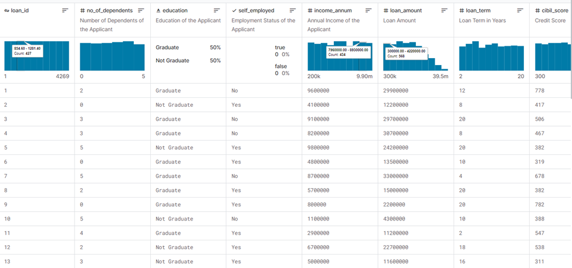

# Loan Approval Prediction

 
## Problem Statement
Loans play a vital role today, serving as a crucial financial tool for individuals. They offer essential support for a wide range of needs, from managing educational expenses and daily living costs to acquiring significant assets like homes and vehicles. It's worth noting that banks generate a substantial portion of their profits by providing loans.

However, when it comes to loan approvals, banks face the challenge of evaluating numerous factors associated with the applicant's profile. It is in this context that this project aims to address the obstacles involved in assessing and predicting the likelihood of loan approval or denial based on various crucial factors. These factors encompass the applicant's credit score, income, employment status, and existing financial obligations.

## User
The primary users experiencing these problems are individuals seeking loans, financial institutions, and regulatory bodies. Loan applicants would benefit by having a clearer understanding of their eligibility, while financial institutions could streamline their approval processes and manage risks more effectively.

## Big Idea
Machine learning can provide solutions by building predictive models that analyze historical loan data and various applicant attributes. Techniques such as classification algorithms can be explored to predict the likelihood of loan approval. Previous approaches may include logistic regression, decision trees, or svm, and they often leverage features like credit history, income, loan amount, and other relevant factors.

## Impact
The societal value lies in facilitating fair and efficient loan approval processes, ensuring that deserving applicants have access to financial resources. This can contribute to economic growth and financial inclusion. Business value includes reduced risk for financial institutions, optimizing their loan portfolios, and potentially lowering default rates.

## About Dataset
Datasets for this project may include historical loan data with details on approved and denied applications, along with attributes such as credit scores, income, employment status, and loan amounts. The dataset might be obtained from financial institutions or relevant repositories. I will use the [Loan-Approval-Prediction-Dataset](https://www.kaggle.com/datasets/architsharma01/loan-approval-prediction-dataset/data), which is published publicly on Kaggle.

The loan approval dataset is a collection of financial records and associated information used to determine the eligibility of individuals or organizations for obtaining loans from a lending institution. It includes various factors such as cibil score, income, employment status, loan term, loan amount, assets value, and loan status. This dataset is commonly used in machine learning and data analysis to develop models and algorithms that predict the likelihood of loan approval based on the given features.

## About columns:
- `loan_id`
- `no_of_dependents`: Number of Dependents of the Applicant
- `education`: Education of the Applicant (Graduate/Not Graduate)
- `self_employed`: Employment Status of the Applicant
- `income_annum`: Annual Income of the Applicant
- `loan_amount`: Loan Amount
- `loan_term`: Loan Term in Years
- `cibil_score`: Credit Score
- `residential_assets_value`
- `commercial_assets_value`
- `luxury_assets_value`
- `bank_asset_value`
- `loan_status`: Loan Approval Status (Approved/Rejected)
